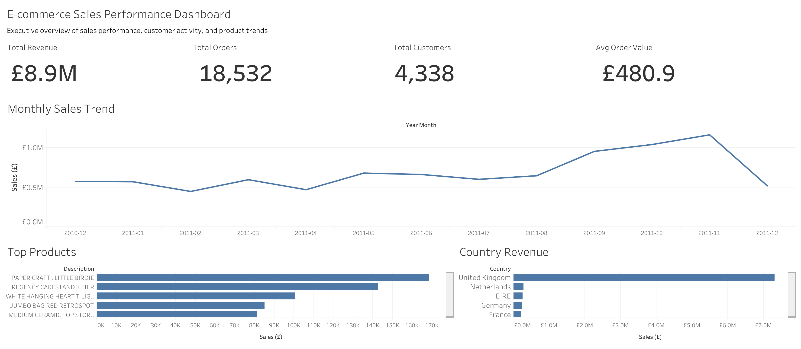

# Ecommerce Sales Analytics Dashboard

[](https://scw634919-bfty.github.io/ecommerce-data-analytics-portfolio/1-ecommerce-sales-performance-analysis/notebook/ecommerce_sales_performance_analysis.html)

## Project Overview

This project analyzes ecommerce transaction data to evaluate sales performance, customer activity, product performance, and geographic sales trends.

Using Python for exploratory data analysis and Tableau for dashboard development, the project transforms raw transaction-level data into business insights that support product, inventory, and sales decision-making.

---

## Business Questions

* How did sales performance change over time?
* Which products generated the highest revenue?
* Which countries contributed the most sales?
* What customer and order patterns can be identified?
* What KPIs summarize ecommerce business performance?

---

## Dashboard Preview



---

## Interactive Dashboard

View the Tableau dashboard here:

**Tableau Public:** [[View Interactive Tableau Dashboard](https://public.tableau.com/views/EcommerceSalesPerformanceDashboard_17799845497770/E-commerceSalesPerformanceDashboard?:language=en-US&:sid=&:redirect=auth&:display_count=n&:origin=viz_share_link)]

---

## Key Metrics

| Metric                    |  Value |
| ------------------------- | -----: |
| Total Revenue             |  $8.9M |
| Total Orders              | 18,532 |
| Total Customers           |  4,338 |
| Average Order Value (AOV) | $480.9 |

---

## Key Insights

* Sales showed stronger performance during the later months of the year, indicating potential seasonality and demand peaks.
* A small number of products generated disproportionately high revenue, suggesting that inventory prioritization for top-performing SKUs may improve performance.
* The United Kingdom contributed the majority of total sales, while countries such as the Netherlands, EIRE, Germany, and France represented important secondary markets.
* Dashboard KPIs provide a high-level executive summary of ecommerce business performance.

---

## Technical Approach

### Data Preparation

* Removed missing customer and product records
* Filtered invalid transactions (`Quantity <= 0`, `UnitPrice <= 0`)
* Converted invoice dates into datetime format

### Feature Engineering

* Created `Sales` column (`Quantity × UnitPrice`)
* Generated `YearMonth` for time-series trend analysis

### Analysis

* Monthly sales trend analysis
* Product performance analysis
* Country-level sales comparison
* KPI generation for business reporting
* Tableau dashboard development

---

## Tech Stack

* Python
* Pandas
* Matplotlib
* Tableau Public
* Jupyter Notebook

---

## Project Files

```text
├── ecommerce_sales_performance_analysis.ipynb
├── README.md
├── images/
│   └── dashboard_preview.png
└── data/
```

---

## Skills Demonstrated

* Data Cleaning
* Feature Engineering
* Exploratory Data Analysis (EDA)
* Ecommerce Sales Analysis
* Product Performance Analysis
* Geographic Sales Analysis
* KPI Reporting
* Data Visualization
* Tableau Dashboard Development
* Business Insight Generation

---

## Future Improvements

* Add customer segmentation (RFM) analysis
* Build sales forecasting models
* Add interactive dashboard filters
* Compare product performance across customer segments
* Analyze repeat purchase behavior
