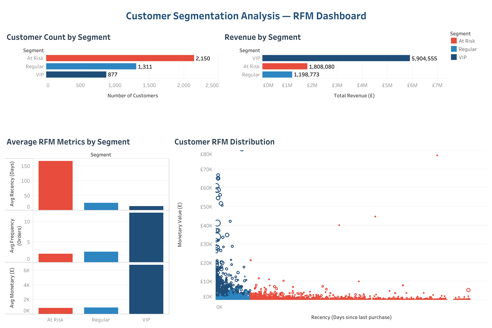

# Customer Segmentation Using RFM Analysis

[](https://scw634919-bfty.github.io/ecommerce-data-analytics-portfolio/2-customer-segmentation-rfm/notebook/customer_segmentation_rfm.html) [](https://public.tableau.com/views/Customer_Segmentation_RFM_Dashboard/CustomerSegmentationDashboard)

## Project Overview

This project analyzes customer purchasing behavior using **RFM analysis**: Recency, Frequency, and Monetary value.

The goal is to segment customers into meaningful groups such as **VIP**, **At Risk**, and **Regular** customers. This type of analysis can help an e-commerce business improve retention, personalize marketing campaigns, and identify high-value customers.

---

## Business Problem

E-commerce companies often have many customers with different purchasing patterns. Without segmentation, it is difficult to know:

- Which customers are the most valuable
- Which customers may stop purchasing soon
- Which customers should receive retention campaigns
- How marketing strategies can be personalized

This project uses transaction-level purchase data to better understand customer behavior and support data-driven marketing decisions.

---

## Dashboard Preview

[](https://public.tableau.com/views/Customer_Segmentation_RFM_Dashboard/CustomerSegmentationDashboard)

---

## Dataset

The dataset contains online retail transaction data.

Key columns used in this analysis include:

| Column | Description |
|---|---|
| `CustomerID` | Unique customer identifier |
| `InvoiceNo` | Unique invoice/order number |
| `InvoiceDate` | Date and time of purchase |
| `Quantity` | Number of items purchased |
| `UnitPrice` | Price per item |
| `Description` | Product description |

A new column, `Sales`, was created by multiplying `Quantity` and `UnitPrice`.

```python
df["Sales"] = df["Quantity"] * df["UnitPrice"]
```

---

## Methodology

This project uses **RFM analysis**, a common customer segmentation method in retail and e-commerce.

### RFM Metrics

| Metric | Meaning | Business Interpretation |
|---|---|---|
| Recency | Days since the customer's last purchase | Lower value means the customer purchased more recently |
| Frequency | Number of unique purchases/orders | Higher value means the customer buys more often |
| Monetary | Total amount spent by the customer | Higher value means the customer contributes more revenue |

---

## Analysis Process

The analysis follows these steps:

1. Import the transaction dataset
2. Clean missing and invalid values
3. Convert invoice dates into datetime format
4. Calculate total sales
5. Create customer-level RFM metrics
6. Assign RFM scores using quartiles
7. Combine RFM scores into one customer score
8. Segment customers into business groups
9. Interpret the results for marketing strategy

---

## Data Cleaning

The dataset was cleaned before analysis by removing:

- Rows with missing `CustomerID`
- Rows with missing `Description`
- Orders with `Quantity <= 0`
- Orders with `UnitPrice <= 0`

This helps remove incomplete records, canceled orders, returns, and invalid transaction values.

```python
df = df.dropna(subset=["CustomerID", "Description"])
df = df[df["Quantity"] > 0]
df = df[df["UnitPrice"] > 0]
```

---

## RFM Calculation

A snapshot date was created using the most recent invoice date plus one day.

```python
snapshot_date = df["InvoiceDate"].max() + pd.Timedelta(days=1)
```

Then, customers were grouped by `CustomerID` to calculate:

- **Recency**: days since last purchase
- **Frequency**: number of unique invoices
- **Monetary**: total sales amount

```python
rfm = df.groupby("CustomerID").agg({
    "InvoiceDate": lambda x: (snapshot_date - x.max()).days,
    "InvoiceNo": "nunique",
    "Sales": "sum"
}).reset_index()
```

---

## Customer Scoring

Each RFM metric was divided into four groups using quartile-based scoring.

```python
rfm["R_score"] = pd.qcut(rfm["Recency"], 4, labels=[4, 3, 2, 1])
rfm["F_score"] = pd.qcut(rfm["Frequency"].rank(method="first"), 4, labels=[1, 2, 3, 4])
rfm["M_score"] = pd.qcut(rfm["Monetary"], 4, labels=[1, 2, 3, 4])
```

### Scoring Logic

- For **Recency**, lower values are better, so recent customers receive higher scores.
- For **Frequency**, higher values are better.
- For **Monetary**, higher values are better.

The final `RFM_Score` combines the three scores into one customer score.

Example:

| R Score | F Score | M Score | RFM Score |
|---|---|---|---|
| 4 | 4 | 4 | 444 |
| 3 | 4 | 4 | 344 |
| 1 | 2 | 2 | 122 |

---

## Customer Segments

Customers were categorized using a simple segmentation rule.

| Segment | Rule | Meaning |
|---|---|---|
| VIP | High RFM scores such as 444, 443, 434, 344 | Recent, frequent, and high-spending customers |
| At Risk | Low recency score, such as 1 or 2 | Customers who have not purchased recently |
| Regular | All other customers | Customers with moderate purchasing behavior |

```python
def segment_customer(row):
    if row["RFM_Score"] in ["444", "443", "434", "344"]:
        return "VIP"
    elif row["R_score"] in [1, 2]:
        return "At Risk"
    else:
        return "Regular"
```

---

## Key Insights

This analysis helps identify different types of customers based on their purchasing behavior:

- **VIP customers** are highly valuable because they purchase recently, frequently, and spend more.
- **At Risk customers** may need retention campaigns because they have not purchased recently.
- **Regular customers** can be targeted with product recommendations or promotional offers to increase engagement.

---

## Business Recommendations

Based on the RFM segmentation, the business can take the following actions:

### VIP Customers

- Offer loyalty rewards or early access to new products
- Avoid over-discounting since these customers already show strong engagement
- Use personalized product recommendations to increase repeat purchases

### At Risk Customers

- Send win-back email campaigns
- Offer limited-time discounts or incentives
- Highlight new arrivals or best-selling products to re-engage them

### Regular Customers

- Encourage repeat purchases through personalized marketing
- Promote bundles or cross-sell opportunities
- Test targeted campaigns based on customer preferences

---

## Tech Stack

- Python
- Pandas
- Jupyter Notebook
- Tableau Public

---

## Project Structure

```text
2-customer-segmentation-rfm/
│
├── data/
│   └── online_retail.csv
│
├── notebook/
│   └── customer_segmentation_rfm.ipynb
│
├── outputs/
│   ├── rfm_segments.csv
│   ├── segment_summary.csv
│   └── rfm_details.csv
│
├── images/
│   └── rfm_dashboard.png
│
└── README.md
```

---

## Output Files

| File | Description |
|------|-------------|
| `outputs/rfm_segments.csv` | Full RFM table with scores and segment labels (4,338 customers) |
| `outputs/segment_summary.csv` | Segment-level aggregates: count, avg RFM metrics, total revenue |
| `outputs/rfm_details.csv` | Detailed RFM metrics per customer for Tableau scatter plots |

---

## Tableau Dashboard

🔗 [View Interactive Dashboard on Tableau Public](https://public.tableau.com/views/Customer_Segmentation_RFM_Dashboard/CustomerSegmentationDashboard)

**Dashboard Views:**
- Segment distribution (customer count by VIP / Regular / At Risk)
- Revenue contribution by segment
- RFM scatter plot (Recency vs Monetary, colored by segment)
- Average Recency / Frequency / Monetary per segment

---

## Key Findings

| Segment | Customers | Avg Monetary | Total Revenue |
|---------|-----------|--------------|---------------|
| VIP | 877 | £6,732.67 | £5,904,555 |
| Regular | 1,311 | £914.40 | £1,198,773 |
| At Risk | 2,150 | £840.97 | £1,808,080 |

---

## Future Improvements

This project can be improved by adding:

- Customer lifetime value (CLV) analysis
- K-means clustering for advanced customer segmentation
- Cohort analysis for retention tracking

---

## Conclusion

This project demonstrates how RFM analysis can be used to turn transaction data into actionable customer insights. By segmenting customers into VIP, At Risk, and Regular groups, an e-commerce business can make better marketing decisions, improve customer retention, and prioritize high-value customer relationships.
