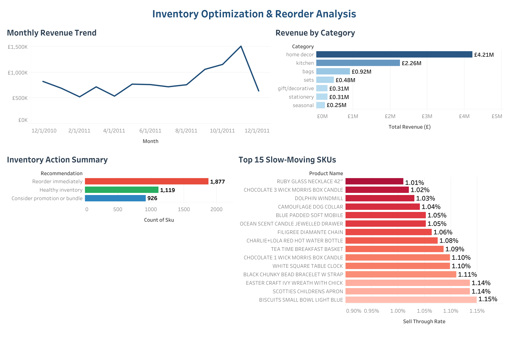

# E-commerce Inventory Optimization & AI Decision Analysis

[](https://scw634919-bfty.github.io/ecommerce-data-analytics-portfolio/3-inventory-optimization-analysis/notebook/inventory_optimization_analysis.html)
[](https://public.tableau.com/views/Inventory_Optimization_Dashboard/InventoryOptimizationDashboard)

## Project Overview

Efficient inventory management is critical in e-commerce because poor stock planning can lead to stockouts, overstock, and revenue loss.

This project analyzes transaction-level retail sales data to evaluate product performance, inventory health, and category-level revenue trends.

Additionally, the project simulates an **AI-assisted inventory decision system** that recommends inventory actions based on stock conditions.

> **Highlight:** The simulated AI Inventory Decision Assistant translates raw stock signals into clear, actionable recommendations across **3,922 SKUs** — flagging **1,877** for immediate reorder, **926** for promotion/bundling, and **1,119** as healthy. This shifts inventory planning from reactive manual review to a scalable, rule-based decision workflow that improves operational efficiency.

---

## Business Problem

This project aims to answer the following business questions:

- Which product categories generate the highest revenue?
- Which products are at risk of stockout?
- Which SKUs are overstocked or slow-moving?
- What actions should be taken to improve inventory efficiency?

---

## Dashboard Preview

[](https://public.tableau.com/views/Inventory_Optimization_Dashboard/InventoryOptimizationDashboard)

---

## Dataset

**Source:** Online Retail Dataset (UCI / Kaggle)

### Features Used

| Feature | Description |
|----------|-------------|
| SKU | Product identifier |
| Product Description | Product name |
| Quantity | Number of units sold |
| Unit Price | Product price |
| Invoice Date | Purchase date |

---

## Methodology

### 1. Data Cleaning

- Removed invalid transactions (negative quantity and price)
- Standardized column names
- Created revenue variable

### 2. Product Categorization

Built a keyword-based categorization system to group products into:

- Home Decor
- Kitchen
- Bags
- Gift / Decorative
- Seasonal
- Sets
- Other

This step improves business interpretability and category-level reporting.

### 3. Sales Trend Analysis

Analyzed:

- Monthly revenue trend
- Category-level revenue contribution
- Product performance

### 4. Inventory Health Analysis

Calculated inventory metrics including:

- Sell-through rate
- Overstock detection
- Stockout risk detection

The project simulates inventory conditions due to the absence of real inventory data.

### 5. AI Inventory Decision Assistant

Built a rule-based recommendation engine to simulate AI-assisted inventory decisions. Each SKU is evaluated against demand-driven thresholds and routed to a business action automatically.

**Decision Logic**

```text
reorder_point = weekly_demand × (lead_time 4wks + safety_stock 2wks)

IF   stockout risk (ending inventory below reorder point)  → Reorder Immediately
ELIF overstock OR sell-through rate < 30%                   → Run Promotion / Bundle
ELSE                                                        → Maintain Inventory
```

| Inventory Condition | Recommendation | SKUs |
|--------------------|----------------|-----:|
| Stockout Risk | Reorder Immediately | 1,877 |
| Overstock / Slow-moving | Run Promotion / Bundle | 926 |
| Healthy Inventory | Maintain Inventory | 1,119 |
| **Total analyzed** | | **3,922** |

By encoding these rules, ~3,900 SKUs are triaged into actionable groups without manual review — demonstrating how analytics can be operationalized into a repeatable decision system rather than a one-time report.

---

## Key Insights

- Home decor and kitchen categories generated the highest revenue.
- Several SKUs showed stockout risk and may require replenishment.
- Overstocked products were identified for promotional opportunities.
- Product categorization improved category-level business reporting.

---

## Business Recommendations

1. Reorder high-demand products with low inventory levels.
2. Bundle or discount slow-moving inventory.
3. Monitor sell-through and inventory turnover regularly.
4. Improve product categorization for more accurate reporting.

---

## Project Structure

```text
3-inventory-optimization-analysis/
│
├── data/
│   └── Online Retail.xlsx
│
├── notebook/
│   └── inventory_optimization_analysis.ipynb
│
├── outputs/
│   ├── monthly_sales.csv
│   ├── category_performance.csv
│   ├── slow_moving_skus.csv
│   └── inventory_reorder_recommendations.csv
│
└── README.md
```

---

## Output Files

| File | Description |
|------|-------------|
| `outputs/monthly_sales.csv` | Monthly revenue and units sold trend |
| `outputs/category_performance.csv` | Revenue and units by product category (excl. other) |
| `outputs/slow_moving_skus.csv` | SKUs with sell-through rate below 30% |
| `outputs/inventory_reorder_recommendations.csv` | Full reorder recommendation table with priority actions |

---

## Tableau Dashboard

🔗 [View Interactive Dashboard on Tableau Public](https://public.tableau.com/views/Inventory_Optimization_Dashboard/InventoryOptimizationDashboard)

**Dashboard Views:**
- Monthly revenue trend (line chart)
- Category revenue breakdown (bar chart)
- Inventory action summary (reorder / healthy / promotion)
- Top 15 slow-moving SKUs by sell-through rate

---

## Tech Stack

- Python
- Pandas
- NumPy
- Matplotlib
- Jupyter Notebook
- Tableau Public

---

## Future Improvements

- Add real inventory data from WMS/ERP
- Implement safety stock calculation with demand variability
- Build ML-based inventory forecasting
- Expand category coverage with more granular product tagging
