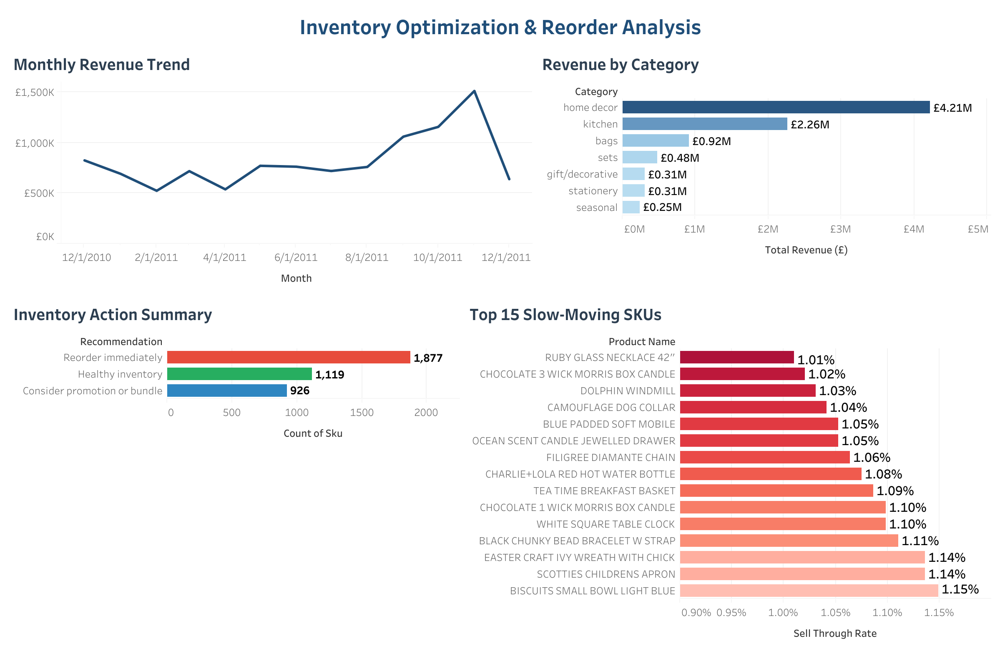
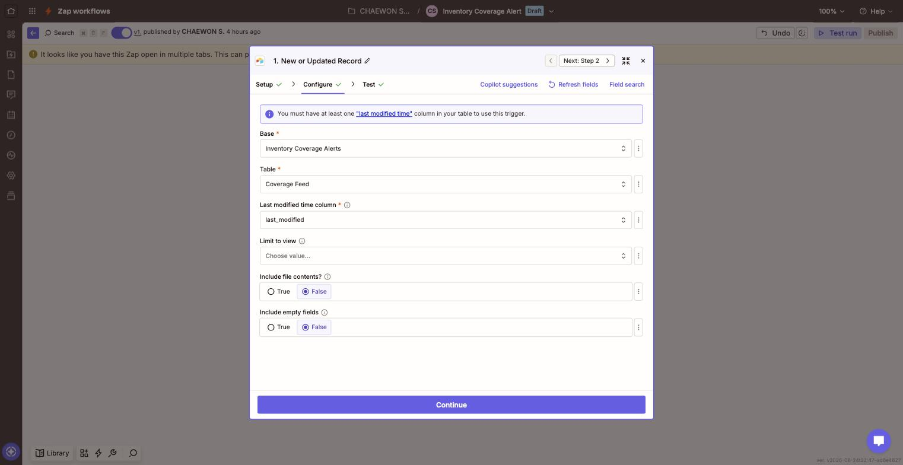
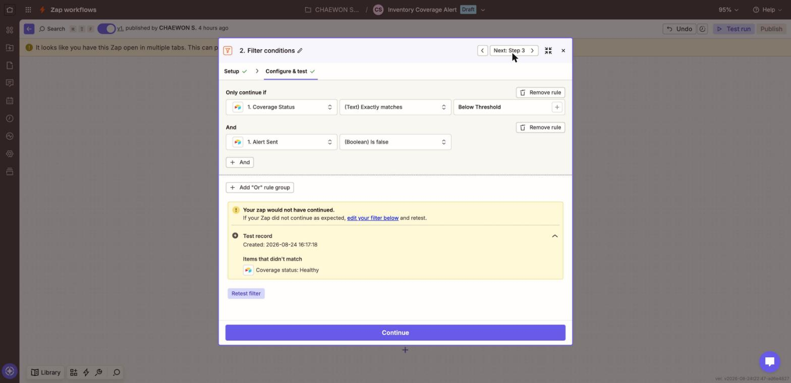
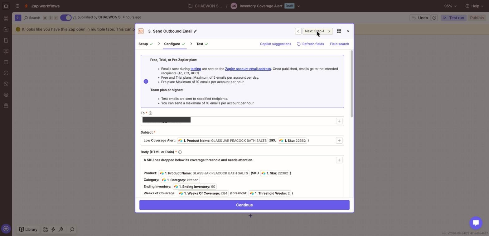
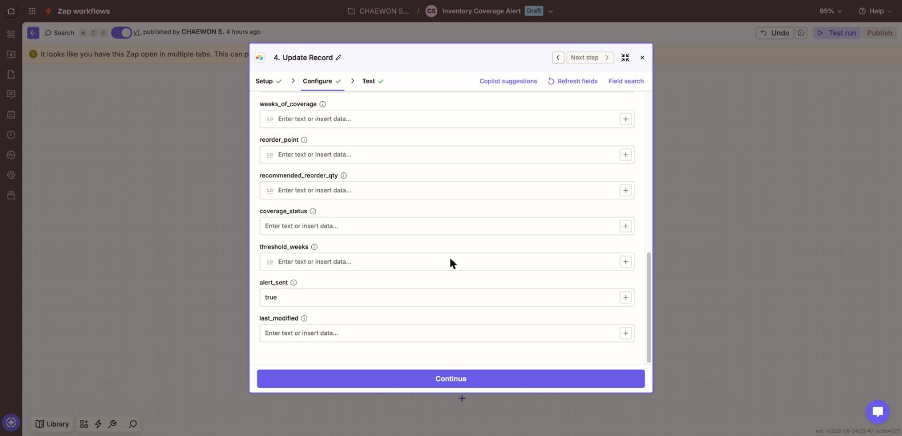
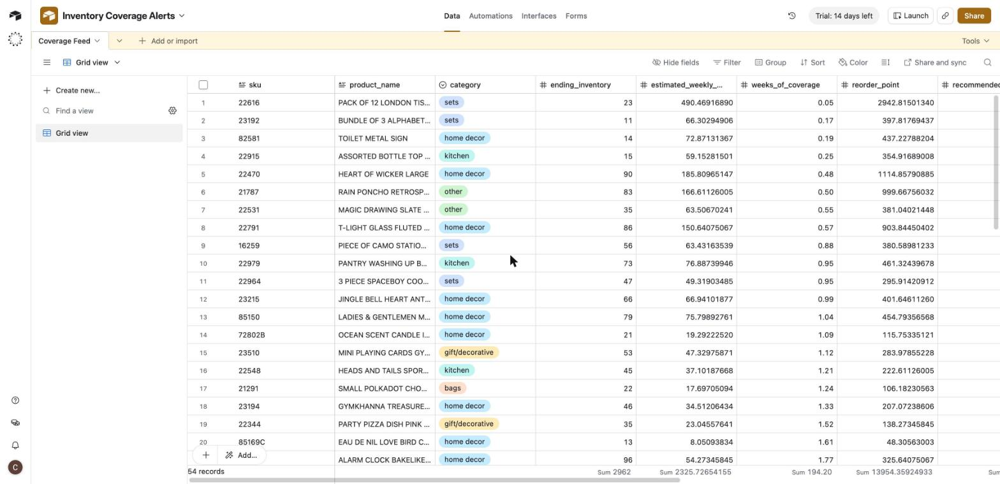

# E-commerce Inventory Optimization & AI Decision Analysis

[](https://scw634919-bfty.github.io/ecommerce-data-analytics-portfolio/3-inventory-optimization-analysis/notebook/inventory_optimization_analysis.html)
[](https://public.tableau.com/views/Inventory_Optimization_Dashboard/InventoryOptimizationDashboard)

## Project Overview

Efficient inventory management is critical in e-commerce because poor stock planning can lead to stockouts, overstock, and revenue loss.

This project analyzes transaction-level retail sales data to evaluate product performance, inventory health, and category-level revenue trends.

Additionally, the project simulates an **AI-assisted inventory decision system** that recommends inventory actions based on stock conditions.

> **Highlight:** The simulated AI Inventory Decision Assistant translates raw stock signals into clear, actionable recommendations across **3,922 SKUs** — flagging **1,877** for immediate reorder, **926** for promotion/bundling, and **1,119** as healthy. This shifts inventory planning from reactive manual review to a scalable, rule-based decision workflow that improves operational efficiency.

---

## Business Problem

This project aims to answer the following business questions:

- Which product categories generate the highest revenue?
- Which products are at risk of stockout?
- Which SKUs are overstocked or slow-moving?
- What actions should be taken to improve inventory efficiency?

---

## Dashboard Preview

[](https://public.tableau.com/views/Inventory_Optimization_Dashboard/InventoryOptimizationDashboard)

---

## Dataset

**Source:** Online Retail Dataset (UCI / Kaggle)

### Features Used

| Feature | Description |
|----------|-------------|
| SKU | Product identifier |
| Product Description | Product name |
| Quantity | Number of units sold |
| Unit Price | Product price |
| Invoice Date | Purchase date |

---

## Methodology

### 1. Data Cleaning

- Removed invalid transactions (negative quantity and price)
- Standardized column names
- Created revenue variable

### 2. Product Categorization

Built a keyword-based categorization system to group products into:

- Home Decor
- Kitchen
- Bags
- Gift / Decorative
- Stationery
- Seasonal
- Sets
- Other

This step improves business interpretability and category-level reporting.

### 3. Sales Trend Analysis

Analyzed:

- Monthly revenue trend
- Category-level revenue contribution
- Product performance

### 4. Inventory Health Analysis

Calculated inventory metrics including:

- Sell-through rate
- Overstock detection
- Stockout risk detection

The project simulates inventory conditions due to the absence of real inventory data.

### 5. AI Inventory Decision Assistant

Built a rule-based recommendation engine to simulate AI-assisted inventory decisions. Each SKU is evaluated against demand-driven thresholds and routed to a business action automatically.

**Decision Logic**

```text
reorder_point = weekly_demand × (lead_time + safety_stock)
                where  lead_time = 4 weeks,  safety_stock = 2 weeks

IF   stockout risk (ending inventory below reorder point)  → Reorder immediately
ELIF overstock OR sell-through rate < 30%                   → Consider promotion or bundle
ELSE                                                        → Healthy inventory
```

| Inventory Condition | Recommendation | SKUs |
|--------------------|----------------|-----:|
| Stockout Risk | Reorder immediately | 1,877 |
| Overstock / Slow-moving | Consider promotion or bundle | 926 |
| Healthy Inventory | Healthy inventory | 1,119 |
| **Total analyzed** | | **3,922** |

By encoding these rules, ~3,900 SKUs are triaged into actionable groups without manual review — demonstrating how analytics can be operationalized into a repeatable decision system rather than a one-time report.

---

## Key Insights

- Home decor and kitchen categories generated the highest revenue.
- Several SKUs showed stockout risk and may require replenishment.
- Overstocked products were identified for promotional opportunities.
- Product categorization improved category-level business reporting.

---

## Business Recommendations

1. Reorder high-demand products with low inventory levels.
2. Bundle or discount slow-moving inventory.
3. Monitor sell-through and inventory turnover regularly.
4. Improve product categorization for more accurate reporting.

---

## Project Structure

```text
3-inventory-optimization-analysis/
│
├── data/
│   └── Online Retail.xlsx
│
├── notebook/
│   └── inventory_optimization_analysis.ipynb
│
├── outputs/
│   ├── monthly_sales.csv
│   ├── category_performance.csv
│   ├── slow_moving_skus.csv
│   └── inventory_reorder_recommendations.csv
│
└── README.md
```

---

## Output Files

| File | Description |
|------|-------------|
| `outputs/monthly_sales.csv` | Monthly revenue and units sold trend |
| `outputs/category_performance.csv` | Revenue and units by product category (excl. other) |
| `outputs/slow_moving_skus.csv` | SKUs with sell-through rate below 30% |
| `outputs/inventory_reorder_recommendations.csv` | Full reorder recommendation table with priority actions |

---

## Tableau Dashboard

🔗 [View Interactive Dashboard on Tableau Public](https://public.tableau.com/views/Inventory_Optimization_Dashboard/InventoryOptimizationDashboard)

**Dashboard Views:**
- Monthly revenue trend (line chart)
- Category revenue breakdown (bar chart)
- Inventory action summary (reorder / healthy / promotion)
- Top 15 slow-moving SKUs by sell-through rate

---

## Low-Code Alerting Prototype (Zapier + Airtable)

To close the loop between analysis and action, the reorder logic above was extended into a lightweight, live monitoring layer using **Airtable** and **Zapier** — turning the static `weeks_of_coverage` calculation into a stakeholder-facing alert instead of a report someone has to remember to check.

> **Highlight:** A 4-step Zap watches an Airtable feed of SKU-level coverage metrics and automatically emails stakeholders the moment a SKU drops below its coverage threshold — replacing manual spreadsheet monitoring with an always-on, rule-based alert.

**Architecture**

An Airtable base (`Inventory Coverage Alerts` → `Coverage Feed` table) mirrors the reorder-point fields from the analysis (`sku`, `product_name`, `category`, `ending_inventory`, `estimated_weekly_demand`, `weeks_of_coverage`, `threshold_weeks`, `coverage_status`, `recommended_reorder_qty`) plus two fields added specifically for alerting: `alert_sent` (boolean) and `last_modified`.

```text
Airtable — Coverage Feed table
   │  row created or updated
   ▼
1. Trigger — New or Updated Record (Airtable)
   │
   ▼
2. Filter — continue only if coverage_status = "Below Threshold" AND alert_sent = false
   │
   ▼
3. Action — Send Outbound Email
   │        SKU, product, category, ending inventory, weeks of coverage,
   │        and recommended reorder qty, formatted for a stakeholder
   ▼
4. Action — Update Record (Airtable)
            writes alert_sent = true back onto the SAME record
   │
   └── next poll: that record now fails the Step 2 filter → stays quiet
        (no duplicate alerts for a SKU that hasn't changed)
```

| Step | Type | Purpose |
|------|------|---------|
| 1. New or Updated Record | Trigger (Airtable) | Polls the Coverage Feed table for any row that was created or changed |
| 2. Filter | Filter by Zapier | Only continues if `coverage_status` = "Below Threshold" and `alert_sent` = false |
| 3. Send Outbound Email | Action (Email by Zapier) | Sends a formatted alert with the SKU's key coverage and reorder metrics |
| 4. Update Record | Action (Airtable) | Writes `alert_sent = true` back onto the triggering record via a dynamic Record ID mapping |

**Why an explicit `alert_sent` flag:** Zapier's own duplicate-run protection isn't guaranteed across polling intervals, so idempotency is handled explicitly in the data instead. Step 4 writes the result of the alert back into the same row that triggered it, which is also why Zapier's editor flags this Zap as a "possible loop" — step 4's write can re-trigger step 1's polling trigger. The loop is intentionally self-terminating: once `alert_sent` is true, the Step 2 filter blocks that record from re-entering the workflow, so each SKU alerts once per threshold breach, not once per poll.

**Screenshots**

<p float="left">
  
  
</p>
<p float="left">
  
  
</p>


**Known limitations**

- Runs on Zapier's polling interval rather than an instant webhook, so alerts lag the underlying data change by a few minutes.
- Built and tested on Zapier's free trial, which caps multi-step Zaps to 14 days without a paid plan — noted here as a deliberate prototype-scope tradeoff, not a design flaw.
- Delivery channel is email only; a Slack/Teams step would be a natural next add for teams that live in chat rather than inbox.

---

## Tech Stack

- Python
- Pandas
- NumPy
- Matplotlib
- Jupyter Notebook
- Tableau Public
- Zapier
- Airtable

---

## Future Improvements

- Add real inventory data from WMS/ERP
- Implement safety stock calculation with demand variability
- Build ML-based inventory forecasting
- Expand category coverage with more granular product tagging
- Move the alerting prototype from a polling trigger to an instant webhook, and add a Slack/Teams delivery option
