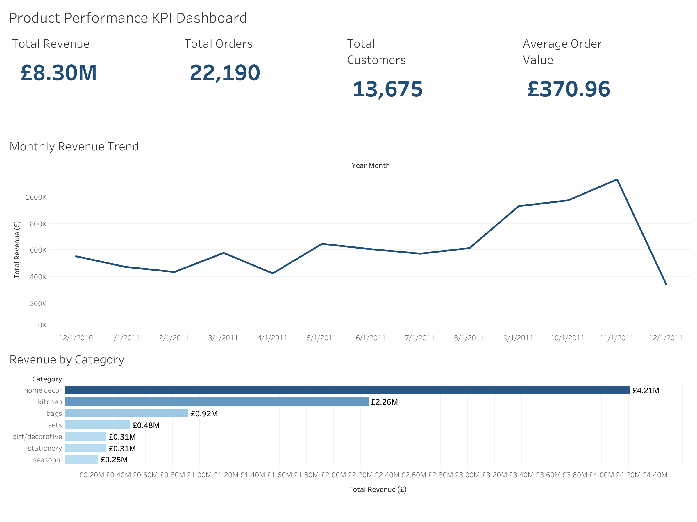

# Product Performance Dashboard (KPI)

[](https://scw634919-bfty.github.io/ecommerce-data-analytics-portfolio/5-product-performance-dashboard-kpi/notebook/product_performance_dashboard_kpi.html)
[](https://public.tableau.com/views/ProductPerformanceKPIDashboard/ProductPerformanceKPIDashboard)

## Project Overview

This project analyzes e-commerce transaction data to build a **Product
Performance KPI Dashboard**.\
The goal is to evaluate business performance using key metrics such as
revenue, orders, customers, product categories, and Average Order Value
(AOV).

The project prepares dashboard-ready datasets that can later be
visualized in Tableau or Power BI.

------------------------------------------------------------------------

## Problem Statement

E-commerce businesses generate large volumes of transactional data, but
raw sales records alone do not clearly reveal:

-   Which product categories generate the highest revenue
-   Monthly sales performance trends
-   Customer purchasing activity
-   Average spending behavior per order

This project transforms raw retail transaction data into actionable KPI
metrics for business decision-making.

------------------------------------------------------------------------

## Dashboard Preview

[](https://public.tableau.com/views/ProductPerformanceKPIDashboard/ProductPerformanceKPIDashboard)

------------------------------------------------------------------------

## Project Objectives

-   Clean and preprocess e-commerce transaction data
-   Create business-friendly KPI metrics
-   Generate monthly performance indicators
-   Analyze category-level sales performance
-   Export dashboard-ready datasets for BI tools

------------------------------------------------------------------------

## Dataset

**Dataset:** Online Retail Dataset

The dataset contains: - Transaction IDs - Product information - Quantity
sold - Unit price - Customer IDs - Order timestamps

------------------------------------------------------------------------

## Project Structure

```text
5-product-performance-dashboard-kpi/
│
├── data/
│   └── Online Retail.xlsx
│
├── notebook/
│   └── product_performance_dashboard_kpi.ipynb
│
├── outputs/
│   ├── monthly_kpi.csv
│   ├── category_kpi.csv
│   └── category_performance.csv
│
├── images/
│   └── kpi_dashboard.png
│
└── README.md
```

------------------------------------------------------------------------

## Workflow

``` text
Raw Data
   ↓
Data Cleaning
   ↓
Feature Engineering
   ↓
KPI Calculation
   ↓
Category Analysis
   ↓
CSV Export
   ↓
Dashboard Visualization
```

------------------------------------------------------------------------

## Data Cleaning

The following preprocessing steps were applied:

-   Converted column names to lowercase
-   Removed missing customer IDs
-   Converted order date to datetime format
-   Created sales column using quantity × unit price

------------------------------------------------------------------------

## Feature Engineering

Since the dataset did not contain product categories, rule-based
categories were created using product keywords.

Example:

  Product Name   Category
  -------------- ----------
  Leather Bag    Bags
  Kitchen Lamp   Lighting
  Gift Box       Sets

------------------------------------------------------------------------

## Key Performance Indicators (KPIs)

### 1. Monthly KPI Metrics

The following KPIs were calculated monthly:

-   Total Revenue
-   Total Orders
-   Total Customers
-   Units Sold
-   Average Order Value (AOV)

**Formula**

AOV = Total Revenue / Total Orders

### 2. Category KPI Metrics

Product performance was analyzed by category to identify:

-   Top-performing categories
-   Revenue contribution by category
-   Sales distribution patterns

------------------------------------------------------------------------

## Tools & Technologies

-   Python
-   Pandas
-   Jupyter Notebook
-   Tableau / Power BI (for dashboard visualization)

------------------------------------------------------------------------

## Key Business Insights

This project demonstrates how transactional sales data can be
transformed into business insights by:

-   Tracking revenue performance over time
-   Understanding customer purchase behavior
-   Identifying high-performing product categories
-   Creating dashboard-ready KPI datasets

------------------------------------------------------------------------

## Output Files

| File | Description |
|------|-------------|
| `outputs/monthly_kpi.csv` | Monthly revenue, orders, customers, units sold, and AOV (13 months) |
| `outputs/category_kpi.csv` | Revenue, orders, and units sold by product category |
| `outputs/category_performance.csv` | Category revenue, units sold, SKU count, and revenue % (used in dashboard) |

---

## Tableau Dashboard

🔗 [View Interactive Dashboard on Tableau Public](https://public.tableau.com/views/ProductPerformanceKPIDashboard/ProductPerformanceKPIDashboard)

**Dashboard Views:**
- KPI summary cards (Total Revenue, Total Orders, Total Customers, Average Order Value)
- Monthly revenue trend (line chart)
- Category revenue breakdown (bar chart)

------------------------------------------------------------------------

## Portfolio Value

This project demonstrates practical analytics skills including:

-   Data Cleaning
-   Feature Engineering
-   KPI Development
-   Business Analytics
-   Dashboard Preparation
-   E-commerce Performance Analysis

------------------------------------------------------------------------

## Author

**Sophie (Chaewon)**\
M.S. Applied Analytics \| Fashion & E-commerce Analytics
