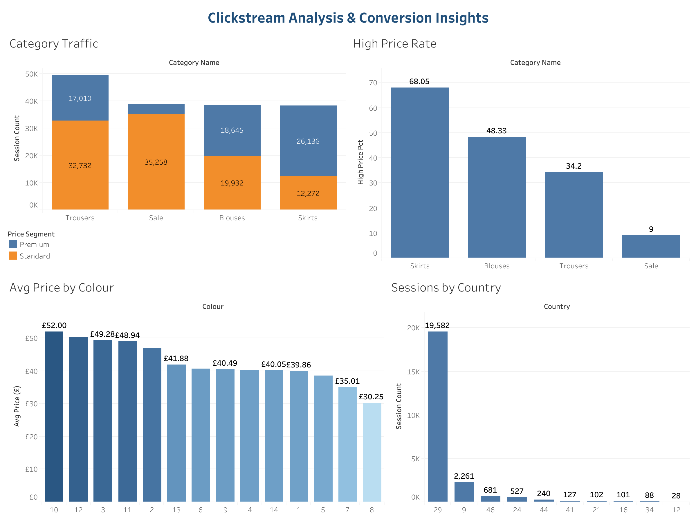

# Clickstream Analysis & Conversion Insights

[](https://scw634919-bfty.github.io/ecommerce-data-analytics-portfolio/6-clickstream-analysis-conversion-insights/notebook/clickstream_analysis_conversion_insights.html)
[](https://public.tableau.com/views/Clickstream_Analysis_Dashboard/ClickstreamAnalysisConversionInsights)

## Project Overview

This project analyzes customer clickstream behavior from an online clothing store to understand browsing patterns, product engagement, and potential conversion drivers.

The goal of this project is to explore how users interact with product categories, colors, locations, and price points, then build a basic machine learning pipeline to predict customer-related behavior.

This project is designed as an e-commerce analytics portfolio project, with a focus on turning raw clickstream data into business insights.

---

## Business Problem

E-commerce businesses need to understand how customers move through a website and which factors influence purchase intent or conversion behavior.

Key business questions include:

- Which product categories attract the most customer activity?
- How do product attributes such as color, location, and price relate to customer behavior?
- Can clickstream data be used to predict user behavior?
- What insights can support better merchandising, product placement, and conversion optimization?

---

## Dashboard Preview

[](https://public.tableau.com/views/Clickstream_Analysis_Dashboard/ClickstreamAnalysisConversionInsights)

---

## Dataset

The analysis uses an online clothing clickstream dataset.

The dataset includes user session and product interaction information such as:

- Date information
- Country
- Session ID
- Product category
- Clothing model
- Product color
- Product location
- Price
- Page interaction details

---

## Tools & Libraries

This project uses Python and common data analysis / machine learning libraries:

- pandas
- matplotlib
- scikit-learn
- Tableau Public

Main techniques used:

- Data loading and cleaning
- Exploratory Data Analysis
- Grouped aggregation
- Data visualization
- One-hot encoding
- Train/test split
- Random Forest classification
- Model evaluation using classification metrics

---

## Project Workflow

### 1. Data Loading

The dataset is loaded using pandas.

```python
df = pd.read_csv("e-shop clothing 2008.csv", sep=";")
```

The dataset uses semicolon-separated values, so `sep=";"` is required.

---

### 2. Data Understanding

The notebook checks the first few rows and column names to understand the structure of the dataset.

```python
print(df.head())
print(df.columns)
```

This step helps identify available variables such as country, product category, color, location, and price.

---

### 3. Data Cleaning

The analysis selects key features and removes rows with missing values in those columns.

Selected features include:

- Country
- Main product category
- Color
- Product location
- Price

```python
features = ["country", "page 1 (main category)", "colour", "location", "price"]
df = df.dropna(subset=features)
```

---

### 4. Feature Engineering

The notebook creates a temporary target variable called `high_price_flag`.

```python
df["high_price_flag"] = (df["price"] > df["price"].median()).astype(int)
```

This variable marks whether a product price is above the median price.

- `1` = above median price
- `0` = below or equal to median price

This is currently used as a practice target for the machine learning model.

---

### 5. Machine Learning Pipeline

The notebook separates categorical and numerical features.

Categorical features:

- Country
- Main category
- Color
- Location

Numerical feature:

- Price

A machine learning pipeline is created using:

- `OneHotEncoder` for categorical variables
- `RandomForestClassifier` for prediction

```python
model = Pipeline([
    ("prep", preprocess),
    ("clf", RandomForestClassifier(random_state=42))
])
```

---

### 6. Model Evaluation

The dataset is split into training and testing sets.

```python
X_train, X_test, y_train, y_test = train_test_split(
    X, y, test_size=0.2, random_state=42
)
```

The model is trained and evaluated using a classification report.

```python
print(classification_report(y_test, pred))
```

The report includes:

- Precision
- Recall
- F1-score
- Accuracy

---

### 7. Exploratory Data Analysis

The notebook also analyzes average product price by color.

```python
price_by_color = df.groupby("colour")["price"].mean().sort_values(ascending=False).head(10)
```

This helps identify which colors are associated with higher average prices.

---

## Key Insights

Based on the current analysis:

- Product attributes such as color and price can be used to explore customer behavior patterns.
- Some colors are associated with higher average product prices.
- Clickstream variables can be transformed into features for predictive modeling.
- A machine learning pipeline can be built using categorical and numerical product data.

---

## Business Recommendations

Based on this analysis, an e-commerce team could:

1. Review high-priced product colors and categories to understand premium product positioning.
2. Analyze customer interaction patterns by product category and country.
3. Use product attributes to support merchandising and website layout decisions.
4. Expand the analysis with a true conversion target, such as purchase completion or add-to-cart behavior.
5. Use future model results to identify factors that increase purchase intent.

---

## Current Limitation

The current notebook uses `high_price_flag` as a temporary machine learning target.

This means the model is predicting whether a product is high-priced, not whether a customer actually converted or purchased.

For a stronger portfolio version, the project should be improved by creating or using a true conversion target.

Examples of better target variables:

- Purchase completed
- Added to cart
- Reached checkout page
- Viewed product detail page
- Session ended with conversion

---

## Project Structure

```text
6-clickstream-analysis-conversion-insights/
│
├── data/
│   └── e-shop clothing 2008.csv
│
├── notebook/
│   └── clickstream_analysis_conversion_insights.ipynb
│
├── outputs/
│   ├── price_by_color.csv
│   ├── category_traffic.csv
│   ├── country_sessions.csv
│   └── price_segment_by_category.csv
│
├── images/
│   └── clickstream_dashboard.png
│
└── README.md
```

---

## Output Files

| File | Description |
|------|-------------|
| `outputs/price_by_color.csv` | Average price and session count per color code |
| `outputs/category_traffic.csv` | Session count, avg price, and premium rate by product category |
| `outputs/country_sessions.csv` | Session volume and pricing behavior by country (47 countries) |
| `outputs/price_segment_by_category.csv` | Standard vs Premium session split by category |

---

## Tableau Dashboard

🔗 [View Interactive Dashboard on Tableau Public](https://public.tableau.com/views/Clickstream_Analysis_Dashboard/ClickstreamAnalysisConversionInsights)

**Dashboard Views:**
- Category traffic: Standard vs Premium segments (stacked bar)
- High-price rate by product category (bar chart)
- Average price by colour code (bar chart)
- Session volume by country — top 10 (bar chart)

---

## Future Improvements

To make this project more complete, future improvements could include:

- Build a true conversion funnel with purchase completion as target
- Analyze session-level behavior and drop-off points
- Calculate conversion rate by product category and country
- Add feature importance analysis from the Random Forest model
- Compare multiple machine learning models

---

## Conclusion

This project demonstrates how clickstream data can be used to analyze e-commerce customer behavior and build a basic predictive model.

Although the current model uses a temporary target variable, the notebook provides a foundation for a stronger conversion-focused analytics project. With additional funnel analysis and a true conversion target, this project can become a more complete portfolio piece for e-commerce or data analyst roles.
